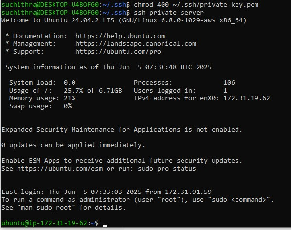
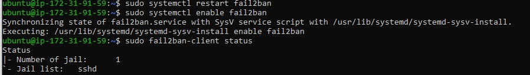

# Bastion Host Setup for Secure Access to Private EC2 Instance
This project demonstrates how to set up a **Bastion Host** in AWS to securely manage access to a private EC2 instance that is not exposed to the public internet.

A Bastion Host acts as a secure gateway, enabling SSH access to private servers through a single hardened entry point. This setup reduces the attack surface and improves security by restricting direct public access to private infrastructure.

### Here are some good resources on bastion hosts and Fail2Ban:

#### Bastion Host Setup and Best Practices:

https://www.strongdm.com/blog/bastion-hosts-with-audit-logging-part-one

StrongDM's Bastion Host AWS Tutorial provides a detailed, step-by-step guide on creating a bastion host, managing SSH keys, and logging SSH commands for audit trails

https://signiance.com/the-ultimate-guide-to-setting-up-a-bastion-host-on-aws/

Signiance's Ultimate Guide to Setting Up a Bastion Host on AWS covers launching, securing, and using a bastion host, including SSH agent forwarding for secure access to private servers.

#### Fail2Ban:

While the above resources focus on bastion hosts, we can integrate Fail2Ban (a log-based intrusion prevention tool) on the bastion host to automatically block IPs showing malicious signs (e.g., repeated failed SSH logins). 

Combining a bastion host with Fail2Ban significantly improves the infrastructure's security by limiting access and actively defending against brute-force attacks.

## Architecture

- **Bastion Host**: Publicly accessible EC2 instance with a public IP.
- **Private Server**: EC2 instance with only a private IP accessible within the VPC.
- **SSH Jump**: Access to the private server is only possible by first connecting to the bastion host.

### Network Architecture
```    
                +---------------------+
                |    Local system     |
                | (Admin/Developer)   |
                +----------+----------+
                           |
                    SSH (Public IP)
                           |
                +----------v----------+
                |   Bastion Host      |
                |   (Public Subnet)   |
                |   EC2/VM Instance   |
                |   Public IP: Yes    |
                +----------+----------+
                           |
                 SSH (Private IP only)
                           |
                +----------v----------+
                |   Private Server    |
                |   (Private Subnet)  |
                |   EC2/VM Instance   |
                |   Public IP: No     |
                +---------------------+
```

## Prerequisites

- AWS account with permissions to create EC2 instances and key pairs.
- Two EC2 instances launched in the same VPC/subnet:
  - Bastion Host (public subnet, with public IP)
  - Private Server (private subnet, no public IP)
- SSH key pairs:
  - `aws-key.pem` for Bastion Host
  - `private-key.pem` for Private Server

---

## Step-by-Step Setup

### 1. Launch EC2 Instances

- Create the Bastion Host EC2 instance with public IP and attach `aws-key.pem`.
- Create the Private Server EC2 instance with no public IP and attach `private-key.pem`.

### 2. Configure Security Groups

- Bastion Host security group:
  - Allow inbound SSH (port 22) from your IP.
- Private Server security group:
  - Allow inbound SSH (port 22) only from the Bastion Host’s private IP.

### 3. Copy Private Key to Bastion Host

```
scp -i aws-key.pem private-key.pem ubuntu@<bastion-public-ip>:~
```
### 4. Set Proper Permissions on Bastion Host

```
ssh -i aws-key.pem ubuntu@<bastion-public-ip>
chmod 400 private-key.pem
```
### 5. SSH to Private Server via Bastion Host

```
ssh -i private-key.pem ubuntu@<private-server-private-ip>
ssh private-server
```
 

### 6. (Optional) Install fail2ban on Bastion Host for SSH Security

```
sudo apt update
sudo apt install fail2ban -y
sudo systemctl enable --now fail2ban
```
 


